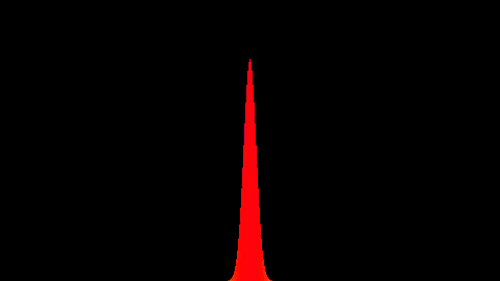

# Simulator for the Schrödinger equation


<p align="center">
  
</p>

### Physics
The simulator solves the time-evolution of a wavefunction according to the Schrödinger equation:
<p align="center">
  <picture>
    <source media="(prefers-color-scheme: dark)" srcset="./img/schrodinger_dark.svg" width="50%">
    
  </picture>
</p>

The initial state is a normalised Gaussian wavepacket in the position representation:
<p align="center">
  <picture>
    <source media="(prefers-color-scheme: dark)" srcset="./img/initial_wavefunction_dark.svg" width="50%">
    
  </picture>
</p>
where $`\Delta x`$ is the variance of the position.

The dynamics of the wavepacket are simulated in an infinite potential well.

### Solver

The Crank-Nicolson method is used to solve the Schrödinger equation numerically. More information about the mathematics behind the discretisation and solving of the equation are provided in the file `crank_nicolson.pdf`.

## Usage
The project was developed on and for Ubuntu, so it might not work on other systems. In a Bash terminal, running running the command:
```
./bin/run_animation
```
in the project root will produce a single `.mp4` file of the time evolution.
