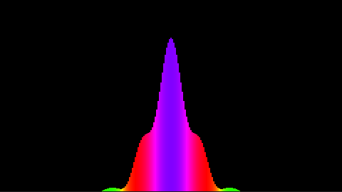

# Simulator for the Schrödinger equation


<p align="center">
  
</p>

### Physics
The simulator solves the time-evolution of the given initial wavefunction according to the Schrödinger equation:

<p align="center">
  
</p>

This solver currently only supports Gaussian wavepackets as initial states:
<p align="center">
  
</p>
where a is a complex valued constant and m is the mass of the particle. With $t=0$, this reduces to the initial state used in the simulations:
<p align="center">
  
</p>

### Solver

The Schrödinger equation can be written in the form:
<p align="center">
  
</p>

Crank-Nicolson is used to compute the time-evolution of the wavefunction:
<p align="center">
  
</p>
where the shorthand notation $\Psi_i^n=\Psi(i\Delta x, n\Delta t)$ is used, the notation $F_i^n$ follows the same logic.

The value of the laplacian $\partial_x^2\Psi_i^n$ can be approximated. The approximation is made by summing the Taylor series
for $\Psi_{i-1}^n$ and $\Psi_{i+1}^n$ around $x$, and discarding terms $\mathcal{O}(\Delta x^4)$. This leads to the approximation
<p align="center">
  
</p>

## Usage

To show the animation of the systems time-evolution:
```
./bin/run_animation
```
